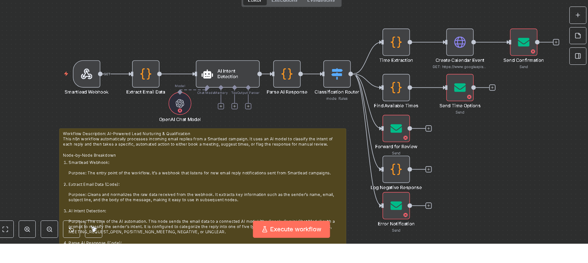

# AI-Powered Lead Nurturing & Qualification

Automates email reply handling from Smartlead campaigns. Uses AI to classify intent and trigger automated actions.

## Features
- Processes incoming email replies automatically
- Classifies lead intent using AI
- Books meetings automatically or suggests times
- Logs negative responses
- Forwards unclear replies for manual review
- Sends error notifications for workflow issues

## Node-by-Node Breakdown
1. Smartlead Webhook - receives new email replies
2. Extract Email Data (Code) - normalizes data
3. AI Intent Detection - classifies replies using AI
4. Parse AI Response (Code) - ensures consistent classification format
5. Classification Router - routes workflow based on intent

## Automated Paths
- MEETING_REQUEST_WITH_TIMES: extracts times, creates calendar event, sends confirmation
- MEETING_REQUEST_OPEN or POSITIVE_NON_MEETING: suggests times, emails options
- NEGATIVE: logs negative response
- UNCLEAR: forwards for manual review

## Setup Steps
1. Import workflow JSON into n8n
2. Add credentials for Smartlead, Google Calendar, email, and AI model
3. Configure email templates and time slots
4. Activate workflow
